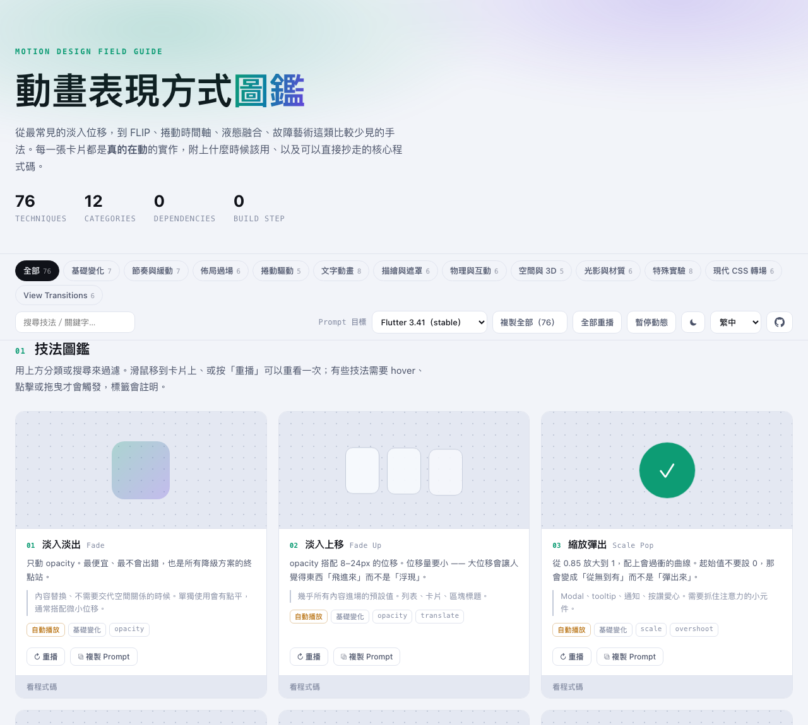
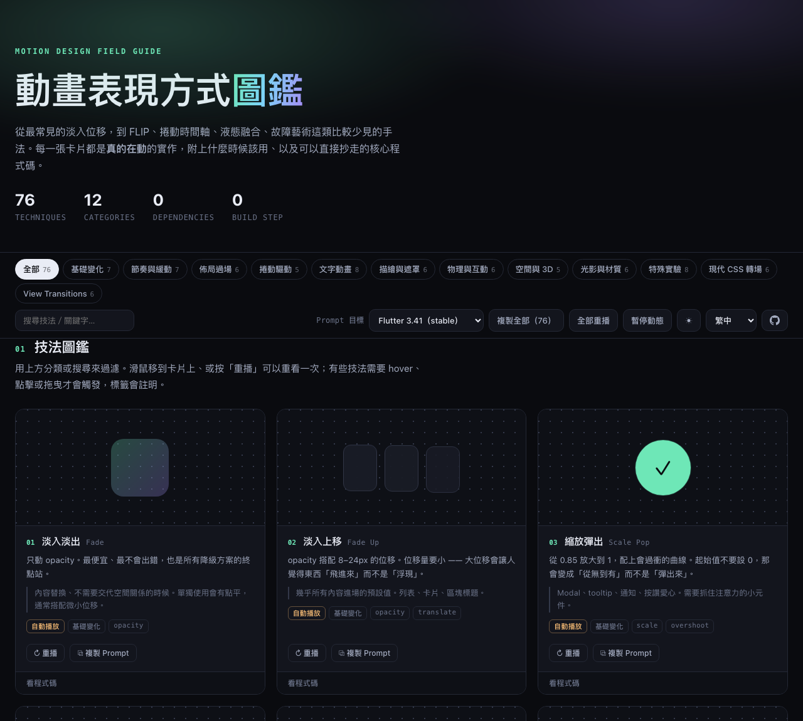
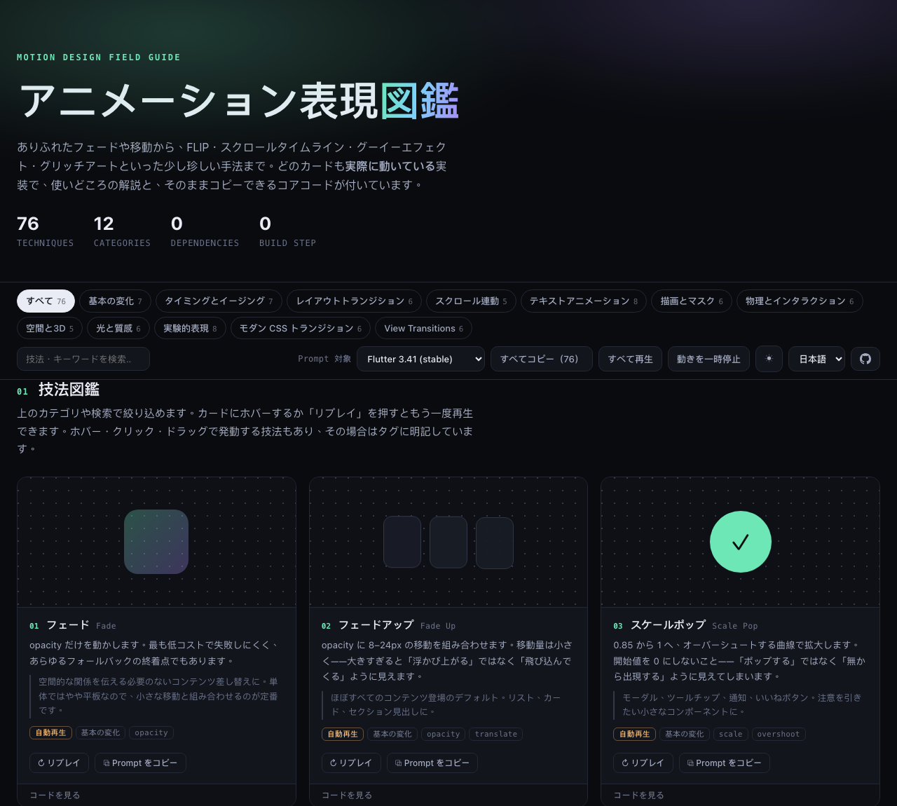

# アニメーション表現図鑑 Motion Design Field Guide

[繁體中文](README.md) ｜ [简体中文](README.zh-CN.md) ｜ [English](README.en.md) ｜ 日本語 ｜ [한국어](README.ko.md)

[](https://github.com/qpalzm963/animation-gallery/stargazers)

[](https://qpalzm963.github.io/animation-gallery/?lang=ja)

**76 種類のウェブアニメーション技法**を収録した、単一ページのインタラクティブ図鑑です。ありふれたフェードや移動から、FLIP、View Transitions、スクロールタイムライン、グーイーエフェクト、グリッチアートといった少し珍しい手法まで。どのカードも**実際に動いている**実装で、カードにホバーするか「リプレイ」を押すともう一度再生でき、使いどころの解説と、そのままコピーできるコアコードが付いています。

**単一の HTML ファイル、依存ライブラリゼロ、すべてネイティブの CSS / Web Animations API / Canvas / SVG。**
各カードに載っているコードスニペットは、ページに実際に注入されている文字列そのもの——目にしているものが、そのまま動いているコードです。

## ライブデモ

**https://qpalzm963.github.io/animation-gallery/?lang=ja**

または [`index.html`](index.html) を直接開くだけ——ビルドもインストールも不要です：

```bash
open index.html
# またはローカルサーバーを起動（View Transitions の一部デモは file:// ではなく http:// が必要）
python3 -m http.server 8991
```

## スクリーンショット

| ライトテーマ | ダークテーマ（`?theme=dark`） |
|---|---|
|  |  |

UI は 5 言語に対応しています。URL に `?lang=` を付ければ特定の言語を直接共有できます。例：[日本語版](https://qpalzm963.github.io/animation-gallery/?lang=ja)：



## 収録内容

12 カテゴリ、76 技法：

| カテゴリ | 収録技法 |
|---|---|
| 基本の変化 | フェード、フェードアップ、スケールポップ、スピン、ブラーイン、フリップイン、方向ワイプ |
| タイミングとイージング | イージング比較、スプリング物理、オーバーシュート、予備動作、スタガー、スカッシュ＆ストレッチ、フォロースルー |
| レイアウトトランジション | FLIP、共有要素トランジション、View Transitions API、リスト並べ替え、シェイプモーフ、高さの自動展開 |
| スクロール連動 | スクロールリビール、パララックス、スクロール進捗、スティッキーシーン、ネイティブ `animation-timeline` |
| テキストアニメーション | タイプライター、テキストスクランブル、スプリットテキスト、マスクリビール、カウントアップ、無限マーキー、バリアブルフォント、キネティックタイポグラフィ |
| 描画とマスク | ラインドローイング、パス追従、クリップリビール、チェックマーク描画、グラデーションマスク、パスモーフ |
| 物理とインタラクション | マグネティックホバー、カーソルトレイル、慣性（モメンタム）、ラバーバンド、パーティクル、リップル |
| 空間と3D | 3D チルトカード、カードフリップ、キューブ回転、レイヤー視差、パースペクティブリスト |
| 光と質感 | スケルトンシマー、グラデーションフロー、グローパルス、フィルムグレイン、グラスモーフィズム、グーイー（メタボール） |
| 実験的表現 | グリッチ、色収差、スプライト／コマ送り、ウェーブグリッド、カーテントランジション、ピクセルディゾルブ、エラスティックインジケーター、オービット |
| モダン CSS トランジション | `@starting-style`、`allow-discrete`、`calc-size()`、`linear()` 純 CSS スプリング、`@property`、マルチトラックキーフレーム |
| View Transitions | old / new のカスタマイズ、`::view-transition-group()`、Transition Types による方向対応、名前の衝突の解説カード、リストから詳細へ、クロスドキュメント遷移（`vt-a.html` / `vt-b.html`） |

さらに収録：

- **アニメーションの12原則 → インターフェース対応** — ディズニーの12原則をインターフェースの語彙に置き換え
- **クロスプラットフォーム対照表** — CSS / Web、Flutter、SwiftUI の概念対照表と、各プラットフォーム固有の表現（SwiftUI の `KeyframeAnimator`、`PhaseAnimator`、Liquid Glass；Flutter の `Hero`、`Curves`）
- **デュレーションとイージングの早見表**

## Prompt ジェネレーター

各カードはワンクリックで構造化された prompt をコピーでき、任意の AI コーディングエージェントに貼り付ければ、その技法のターゲットフレームワークにおける自然な実装が得られます。ツールバーでターゲットフレームワーク（Flutter / SwiftUI / React + Framer Motion / 純 CSS）を選択でき、prompt が運ぶのは CSS の逐行翻訳の依頼ではなく**ビジュアル仕様**で、そのフレームワークの慣用的な書き方のリマインダーも添えられます。

## 機能

- カテゴリフィルタ、キーワード検索
- 単一カードのリプレイ／すべて再生
- 5 言語の UI（繁體中文／简体中文／English／日本語／한국어、右上で切り替え）、選択は記憶されます
- 各カードへのディープリンク（カード番号をクリックすると `#t-技法id` リンクをコピー）、特定の技法を直接共有できます
- ダーク／ライトテーマ切り替え（デフォルトはライト）、選択は記憶されます
- `prefers-reduced-motion` を検出するとデモアニメーションを自動的に一時停止し、「それでも見る」オプションを提供します
- 画面外のデモは自動アンマウントされ、大量のデモが同時に動いてパフォーマンスを落とすことを防ぎます

## ライセンス

[MIT](LICENSE) — 自由に利用・改変・再配布できます。

---

役に立ったと感じたら、右上の ⭐ Star をお願いします。より多くの人にこの図鑑が届きます。
