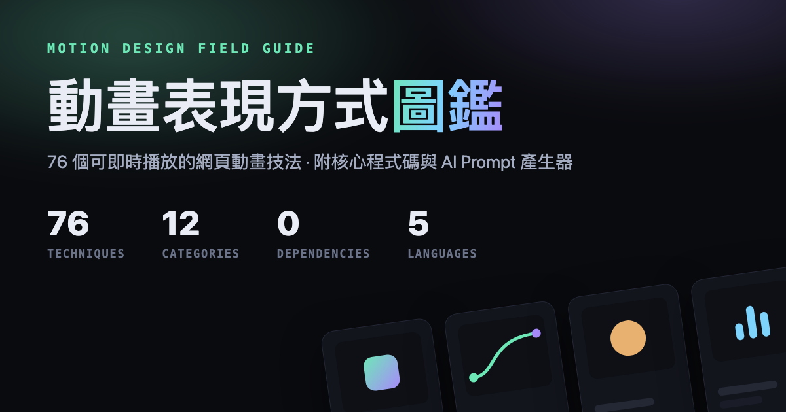

# 動畫表現方式圖鑑 Motion Design Field Guide

[English](README.en.md) ｜ 繁體中文

[](https://github.com/qpalzm963/animation-gallery/stargazers)

[](https://qpalzm963.github.io/animation-gallery/)

一份單頁互動圖鑑，收錄 **76 個網頁動畫技法** —— 從最常見的淡入位移，到 FLIP、View
Transitions、捲動時間軸、液態融合、故障藝術這類比較少見的手法。每一張卡片都是**真的在
動**的實作：滑鼠移到卡片上或按「重播」可以重看一次，附上什麼時候該用、以及可以直接抄走
的核心程式碼。

**單一 HTML 檔、零相依套件、全部原生 CSS / Web Animations API / Canvas / SVG。**
示範用的程式碼片段就是實際注入頁面的那份字串 —— 你看到的就是真的在跑的。

## 線上瀏覽

**https://qpalzm963.github.io/animation-gallery/**

或打開 [`index.html`](index.html)，不需要建置或安裝任何東西：

```bash
open index.html
# 或起個本機伺服器（View Transitions 的部分示範需要 http:// 而非 file://）
python3 -m http.server 8991
```

## 內容

12 個分類、76 個技法：

| 分類 | 收錄 |
|---|---|
| 基礎變化 | 淡入、淡入上移、縮放彈出、旋轉、模糊聚焦、翻轉、方向擦除 |
| 節奏與緩動 | 緩動曲線並排對照、彈簧物理、過衝回彈、預備動作、錯位延遲、擠壓伸展、跟隨重疊 |
| 佈局過場 | FLIP、共享元素、View Transitions API、列表重排、形狀變形、高度自動展開 |
| 捲動驅動 | 捲入顯現、視差、捲動進度、釘住場景、原生 `animation-timeline` |
| 文字動畫 | 打字機、亂碼解碼、逐字錯位、遮罩上推、數字滾動、跑馬燈、可變字型、動態排版 |
| 描繪與遮罩 | 線條描繪、沿路徑移動、幾何遮罩擴散、打勾繪製、漸層擦除、路徑變形 |
| 物理與互動 | 磁吸、拖尾游標、慣性滑行、橡皮筋阻尼、粒子系統、觸點波紋 |
| 空間與 3D | 傾斜卡片、翻牌、立方體、滑鼠分層視差、透視列表 |
| 光影與材質 | 骨架微光、流動漸層、呼吸光暈、顆粒噪點、玻璃模糊、液態融合 |
| 特殊實驗 | 故障藝術、色差、逐格 sprite、波浪網格、幕簾轉場、像素溶解、彈性指示器、軌道系統 |
| 現代 CSS 轉場 | `@starting-style`、`allow-discrete`、`calc-size()`、`linear()` 純 CSS 彈簧、`@property`、多軌道 keyframes |
| View Transitions | 自訂新舊畫面、`::view-transition-group()`、方向感知轉場、命名撞名教學、清單→詳情、跨文件轉場（`vt-a.html` / `vt-b.html`） |

另外收錄：

- **動畫十二法則 → 介面對照** — 迪士尼十二法則換成介面語彙
- **跨平台對照** — CSS / Web、Flutter、SwiftUI 的概念對照表，以及各平台獨有的表現方式
  （SwiftUI 的 `KeyframeAnimator`、`PhaseAnimator`、Liquid Glass；Flutter 的 `Hero`、`Curves`）
- **時長與曲線速查表**

## Prompt 產生器

每張卡片可以一鍵複製一段結構化 prompt，貼給任何 AI coding agent 就能產出該技法在目標
框架的道地實作。工具列選擇目標框架（Flutter / SwiftUI / React + Framer Motion / 純
CSS），prompt 帶的是**視覺規格**而不是要求逐行翻譯 CSS，並會附上該框架的慣用寫法提醒。

## 功能

- 分類篩選、關鍵字搜尋
- 單卡重播 / 全部重播
- 五種語言介面（繁體中文／简体中文／English／日本語／한국어，右上角切換），選擇會記住
- 每張卡片都有深連結（點卡片編號複製 `#t-技法id` 連結），可以直接分享特定技法
- 深色／淺色主題切換（預設淺色），選擇會記住
- `prefers-reduced-motion` 偵測，會自動暫停示範動畫並提供「還是想看」的選項
- 離屏自動卸載，避免大量示範同時運行拖垮效能

## 授權

[MIT](LICENSE) — 可自由取用、修改與再散布。

---

覺得有幫助的話，麻煩點個右上角的 ⭐ Star，讓更多人看到這份圖鑑。
